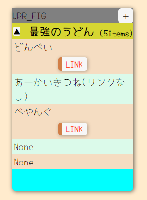
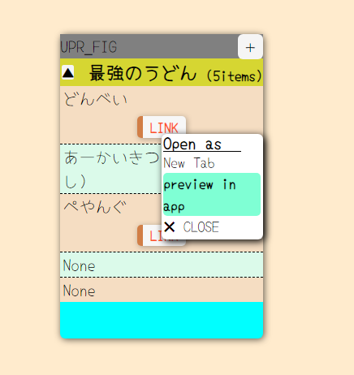
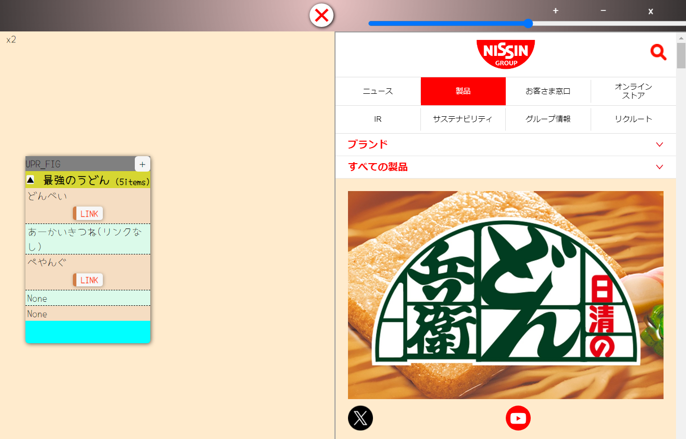

# アプリ名　MEMOLINK
***
## 本アプリの概要・使い方
  * **どんなアプリ？**
    気になった記事のリンクや、学習メモなどをテーマごとに整理することができます。<br>
    また、FIREBASEを活用することで、共有編集が可能となり、<br>
    * ちょっとしたメモ掲示板(例.原宿周辺のおすすめデートスポット教えて！)  
    * ナレッジベース構築(例.JSマスターするために覚えるべき機能集) 

     などが簡単に構築できます。
    　
    Fig.1 構築事例（てきとう）
<br>
  * **使用方法【暫定】**
    **<ツール操作の流れ>**
    1. ヘッダ右上の`+`ボタンをクリックし、新規カードを作成する
    1. 作成されたカードの内容を編集する
        1. タイトルに表示されているテキストをダブルクリックする
        ➡`textarea`要素が出現し、入力待ちとなる 
        1. 記載内容を入力し、カード外をクリックする
        ➡`tetarea`に入力した内容が要素内のテキストに反映される
        1. 本文に表示されているテキストをダブルクリックする
        ➡`textarea`要素が**説明文**と**参考URL**入力用で出現し、入力待ちとなる
        1. 記載内容を入力し、カード外をクリックする
        ➡`tetarea`に入力した内容が要素内のテキストに反映され
        　＋`LINK`ボタンが表示される
     ※ 項目を追加するにはカード右上の`＋`ボタンをクリックする
     ※ 数が増えすぎたカードは`▲`ボタンをでたたむことができる
    1. 追加された内容を確認する`LINK`ボタン➡オプションを選択(Fig.2)
      (New Tab：新しいタブで開く、Preview in app：iframeを使用し、アプリ内で表示)

    　  
          　Fig.2 LINKオプション   　　　　Fig.3 アプリ内プレビュー(幅変更可能)
  

***
## 工夫した点
  * **編集可能な領域をtextareaとして表示しない、入力時だけ一時的に使用する**
    画面を構成する要素は`div,p`要素で構成されているため、基本的に編集できない。  
    ダブルクリックした際に`textarea`を挿入し、インターフェースとして活用している。
    うっかり消してしまうことの無いよう、こういった仕組みを採用している。<br>  

  * **クリックアクションがたくさん入っているので、操作感が直観的で楽しい**
    * ダブルクリックで編集開始<br>
    * カード外クリックで編集完了<br>
    * 各種ボタン操作による機能発動

  * **蓄えたリンクをアプリ上でも確認可能**
    アクセス拒否されるばしょはNew tabで開く必要があるが、
    タブ切り替えしなくても情報を閲覧できる仕組みを作った
***
## 苦戦した点
  * **eventの処理が非常に大変でした**
  前回のメモ帳アプリが完成しなかった最大の原因でした。  
  本アプリのように、各種クリックイベントの対象範囲がラップしているため、  
  event発生時に予期せぬファンクションの起動が多発します。  
  eventバブリングの仕組み、基本的な対処を確認した上で実装、  
  どうにもならない部分は自分なりに処理を分岐させる手法を確立しました。  
  ```javascript
  // ***意図せぬeventの発生を防ぐための方策***  
    $(document).on("click","#click_btn", function(e){
    // [1] aタグのジャンプ等要素ごとクリックじの標準の動き
        e.preventDefault() //aタグだったらページ遷移が発生しない 
    // [2] eventのバブリングをシステム的に止める➡不自然な状況なので乱用厳禁
        e.stopPropagation() //バブリング停止
        e.stopImmediatePropagation() //バブリング停止＋同ターゲット・イベントに対する呼び出しを行わない

    // [3] クリックした要素を厳密に特定しておいて、等event内のみで動くような処理を書く
        // thisはどれなのか？？ Jqueryの場合はjqオブジェクトがthisみたい
        let clicked_case1 = $(this) // thisは$(document)なので不一致
        let clicked_case2 = $(e.target) //クリックされた要素なので一致
        
        if(clicked_case2 == "#click_btn"){
        |  // 本来event発生で期待している処理を書く//
        | // 厳密なクリック位置で処理が分岐するので、//
        |//バブリングが発生してもスルー出来る//
        } 
    });
  ```
\
    また、jsで追加した要素に関しては、直接jqueryの`.on()`メソッドを使うことができません。
  
  ```javascript
//[NG]
$(#click_btn).on("click", function(e){process})
//[OK]
$(document).on("click","#click_btn", function(e){process});
  ```
上記のように対処する必要がありますが、今後は`this`が変わるので、
`if(this == e.target){}`みたいな判定が使えなくなります。<br>こういった特性しっかり理解しておく必要があると感じました
* **firebase連携の処理が未完成でオンプレミス環境同様の動きを再現できていない**
    event処理と仕組みの実現を優先しており、firebaseの機能は後付けになっている。<br>そのため、各首位event関数がhtmlを操作する処理をコメントアウトし、<br>firebaseに送信する機能に改修した。<br>同時に`onChildAdded`でデータを読み込みHTMLに反映する処理を含んでいる。<br>後付けになってしまっているので、使用する局面に応じて、`mode`を指定し、<br>それぞれに対応したobjectの送受信を行う。<br>内部的に処理する部分が多いので、クラウドに上がるデータ量自体は少ないと思う。<br>それと忙しさを理由にまだデプロイできていない。いい加減に取り組みなさい。(セルフ喝) 

***
## 参考にした web サイトなど
* [イベントの伝搬(キャプチャリングとバブリング)](https://www.javadrive.jp/javascript/event/index10.html)
➡クリックイベントの動きががおかしい原因
* [【コピペ可】HTMLとCSSでカードのデザイン６選](https://eclair.blog/examples-of-card/)
➡カードデザインの参考
  